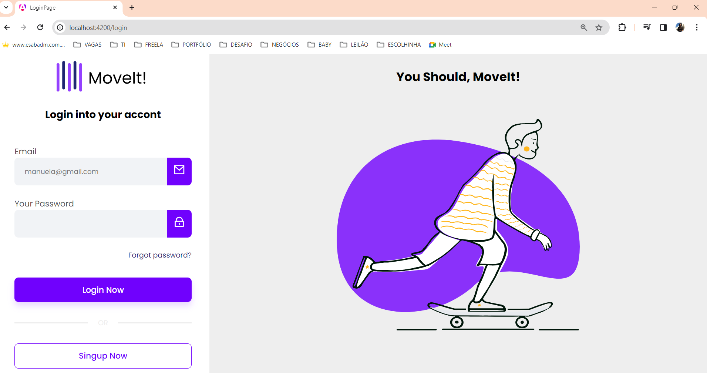
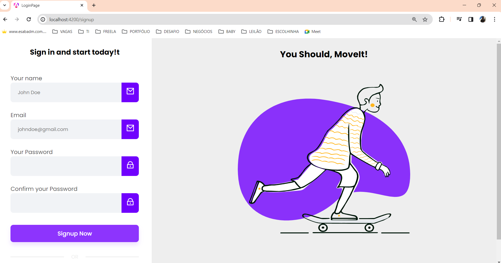

<h1>Login Page - Frontend</h1>

Este projeto é uma página de login desenvolvido com [Angular CLI](https://github.com/angular/angular-cli) versão 17.3.2.. 
A aplicação foi desenvolvida usando HTML, CSS e Angular.

<h1 align="center">
    
    
</h1>

## 💻 Requisitos

Antes de iniciar, você deve ter o Node.js e o NPM instalados em sua máquina.

## 🚀 Instalando

Primeiro, você deve clonar o projeto na sua máquina, para isso você
pode colar o seguinte comando em seu terminal

```bash
git clone https://github.com/anacmenezes/login-page.git
cd login-page
```

Para executar o servidor de desenvolvimento:

```terminal
ng server
```

Por fim, para executar o projeto basta rodar o seguinte:

```terminal
npm start
Navegue até `http://localhost:4200/
```

## 🔧 Compilação

Para compilar a aplicação para produção, execute o seguinte comando:

```terminal
ng build
```
Isso irá gerar uma versão otimizada da aplicação na pasta dist.

## 🔍 Executanto testes

```testes unitários
Execute 'ng test' para executar os testes unitários via [Karma](https://karma-runner.github.io).
```

```testes End-To-End
Execute 'ng e2e' para executar os testes end-to-end através de uma plataforma de sua escolha.
Para usar este comando, você precisa primeiro adicionar um pacote que implemente as capacidades
de teste end-to-end.
```

## 📱 Minhas Redes

Instagram: [@1carulm](https://www.instagram.com/1carulm/) &nbsp;&middot;&nbsp;

Linkedin [@AnaMenezes](https://www.linkedin.com/in/ana-menezes-882a8b257/) &nbsp;&middot;&nbsp;
